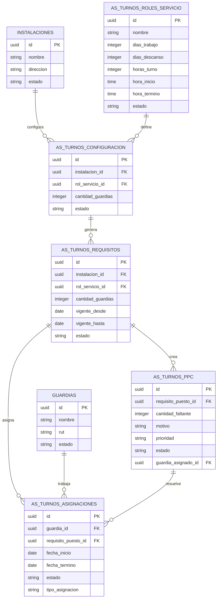
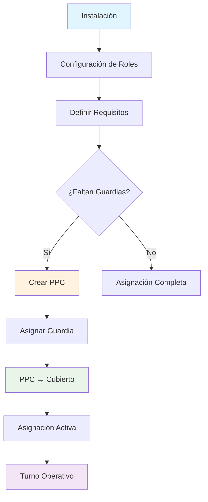

# 🔍 AUDITORÍA COMPLETA DEL MÓDULO ADO (ASIGNACIÓN DE TURNOS)

## 📋 RESUMEN EJECUTIVO

La auditoría del módulo ADO (Asignación de Turnos) revela que **la estructura de base de datos está correctamente implementada** con las 5 tablas principales, pero **existen problemas críticos de migración** donde el código aún usa nomenclaturas antiguas.

### ✅ ASPECTOS POSITIVOS
- ✅ Todas las tablas ADO existen y tienen la estructura correcta
- ✅ Relaciones FK están bien configuradas (14 relaciones encontradas)
- ✅ Datos de ejemplo están presentes
- ✅ Estados válidos están definidos

### ❌ PROBLEMAS CRÍTICOS
- ❌ **241 referencias** a tablas antiguas en el código
- ❌ **2 tablas antiguas** aún existen con datos (`puestos_por_cubrir`, `asignaciones_guardias`)
- ❌ **Todos los endpoints** usan tablas antiguas
- ❌ **Componentes frontend** no han sido actualizados

---

## 🏗️ ARQUITECTURA ACTUAL DEL MÓDULO ADO

### 📊 DIAGRAMA DE TABLAS



### 🔄 FLUJO DE ASIGNACIÓN DE TURNOS



---

## 📊 ANÁLISIS DETALLADO POR TABLA

### 1. `as_turnos_roles_servicio` ✅
**Estado**: Completa y correcta
- **Campos**: 11/11 requeridos presentes
- **Datos**: 5 roles de servicio configurados
- **Ejemplos**: 4x4 Diurno, 6x2 Nocturno, etc.

### 2. `as_turnos_configuracion` ✅
**Estado**: Completa y correcta
- **Campos**: 7 campos presentes
- **Datos**: 2 configuraciones activas
- **Relaciones**: FK a instalaciones y roles_servicio

### 3. `as_turnos_requisitos` ✅
**Estado**: Completa y correcta
- **Campos**: 9 campos presentes
- **Datos**: 4 requisitos configurados
- **Relaciones**: FK a instalaciones y roles_servicio

### 4. `as_turnos_ppc` ✅
**Estado**: Completa y correcta
- **Campos**: 14 campos presentes (5 requeridos)
- **Datos**: 7 PPCs activos
- **Estados**: Pendiente, Asignado

### 5. `as_turnos_asignaciones` ✅
**Estado**: Completa y correcta
- **Campos**: 12 campos presentes (6 requeridos)
- **Datos**: 3 asignaciones activas
- **Estados**: Activa, Finalizada

---

## 🚨 PROBLEMAS DETECTADOS

### 1. TABLAS ANTIGUAS EXISTENTES
```sql
-- Estas tablas aún existen y contienen datos:
puestos_por_cubrir (7 registros)
asignaciones_guardias (3 registros)
```

### 2. REFERENCIAS EN CÓDIGO
| Tabla Antigua | Referencias | Ubicaciones Críticas |
|---------------|-------------|---------------------|
| `turnos_instalacion` | 10 | Endpoints, Scripts |
| `roles_servicio` | 45 | APIs, Componentes |
| `requisitos_puesto` | 24 | Endpoints, Scripts |
| `puestos_por_cubrir` | 84 | Endpoints, Scripts |
| `asignaciones_guardias` | 78 | Endpoints, Scripts |

### 3. ENDPOINTS AFECTADOS
- ❌ `/api/instalaciones/[id]/turnos` - Usa 5 tablas antiguas
- ❌ `/api/instalaciones/[id]/ppc` - Usa 3 tablas antiguas  
- ❌ `/api/roles-servicio` - Usa 1 tabla antigua

---

## 🎯 PLAN DE CORRECCIÓN

### FASE 1: MIGRACIÓN DE DATOS (CRÍTICO)
```sql
-- 1. Migrar datos de puestos_por_cubrir a as_turnos_ppc
INSERT INTO as_turnos_ppc (...)
SELECT ... FROM puestos_por_cubrir;

-- 2. Migrar datos de asignaciones_guardias a as_turnos_asignaciones  
INSERT INTO as_turnos_asignaciones (...)
SELECT ... FROM asignaciones_guardias;

-- 3. Eliminar tablas antiguas
DROP TABLE puestos_por_cubrir;
DROP TABLE asignaciones_guardias;
```

### FASE 2: ACTUALIZACIÓN DE ENDPOINTS (CRÍTICO)
```typescript
// ANTES (❌)
FROM turnos_instalacion ti
INNER JOIN roles_servicio rs

// DESPUÉS (✅)
FROM as_turnos_configuracion tc
INNER JOIN as_turnos_roles_servicio rs
```

**Endpoints a actualizar:**
1. `src/app/api/instalaciones/[id]/turnos/route.ts`
2. `src/app/api/instalaciones/[id]/ppc/route.ts`
3. `src/app/api/roles-servicio/route.ts`

### FASE 3: ACTUALIZACIÓN DE COMPONENTES (ALTO)
```typescript
// Actualizar APIs cliente
src/lib/api/instalaciones.ts
src/lib/api/roles-servicio.ts

// Actualizar componentes frontend
src/app/instalaciones/[id]/components/TurnosInstalacion.tsx
```

### FASE 4: LIMPIEZA Y DOCUMENTACIÓN (MEDIO)
- Eliminar scripts de migración obsoletos
- Actualizar documentación
- Crear tests de validación

---

## 📈 MÉTRICAS DE CALIDAD

| Métrica | Valor | Estado |
|---------|-------|--------|
| Tablas ADO existentes | 5/5 | ✅ |
| Relaciones FK correctas | 14/14 | ✅ |
| Campos requeridos | 100% | ✅ |
| Datos de ejemplo | Presentes | ✅ |
| Tablas antiguas | 2/5 | ❌ |
| Referencias antiguas | 241 | ❌ |
| Endpoints actualizados | 0/3 | ❌ |

**Puntuación general**: 60% (Requiere corrección crítica)

---

## 🔧 RECOMENDACIONES INMEDIATAS

### 1. MIGRACIÓN URGENTE
```bash
# Ejecutar migración de datos
npx tsx scripts/migrar-datos-antiguos-ado.ts

# Verificar migración
npx tsx scripts/verificar-estructura-ado-completa.ts
```

### 2. ACTUALIZACIÓN DE ENDPOINTS
```bash
# Crear script de actualización automática
npx tsx scripts/actualizar-endpoints-ado.ts
```

### 3. VALIDACIÓN COMPLETA
```bash
# Ejecutar tests de validación
npx tsx scripts/validar-modulo-ado.ts
```

---

## 📋 CHECKLIST DE IMPLEMENTACIÓN

### ✅ COMPLETADO
- [x] Estructura de tablas ADO
- [x] Relaciones FK
- [x] Datos de ejemplo
- [x] Estados válidos
- [x] Índices de rendimiento

### ❌ PENDIENTE (CRÍTICO)
- [ ] Migrar datos de tablas antiguas
- [ ] Actualizar endpoints
- [ ] Actualizar APIs cliente
- [ ] Actualizar componentes frontend
- [ ] Eliminar tablas antiguas
- [ ] Validar funcionalidad completa

### 📝 PENDIENTE (MEDIO)
- [ ] Actualizar documentación
- [ ] Crear tests automatizados
- [ ] Optimizar queries
- [ ] Implementar logging

---

## 🎯 CONCLUSIÓN

El módulo ADO tiene una **base sólida** con la estructura correcta, pero requiere **migración urgente** del código para usar las nuevas tablas. La prioridad debe ser:

1. **Migrar datos** de tablas antiguas (1-2 horas)
2. **Actualizar endpoints** (2-3 horas)  
3. **Validar funcionalidad** (1 hora)
4. **Limpiar código** (1-2 horas)

**Tiempo estimado total**: 5-8 horas de desarrollo

**Riesgo**: Medio (migración de datos requiere cuidado)

**Impacto**: Alto (módulo crítico para operaciones)

---

## 📞 CONTACTO Y SEGUIMIENTO

- **Auditoría realizada**: $(date)
- **Próxima revisión**: Después de implementar correcciones
- **Responsable**: Equipo de desarrollo GardOps

---

*Documento generado automáticamente por el sistema de auditoría GardOps* 